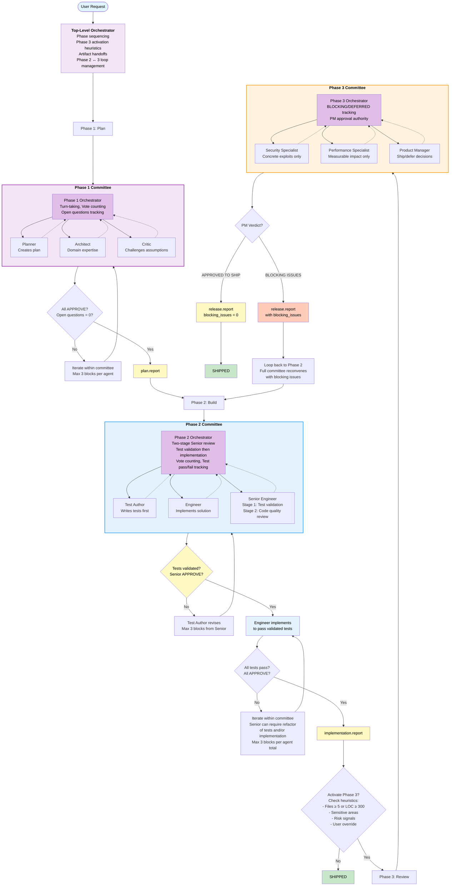

# Orchestration Logic

## System Architecture



## Top-Level Orchestrator

**Responsibilities:**

- Manage phase transitions
- Evaluate Phase 3 activation heuristics
- Coordinate artifact handoffs
- Manage Phase 2 ↔ 3 loop

**State Machine:**

```
IDLE
  │
  ├─ receive_user_request()
  │    │
  │    ▼
  └─→ PHASE_1_PLAN
       │
       ├─ wait_for_phase_1_consensus()
       │    │
       │    ▼
       └─→ PHASE_2_BUILD
            │
            ├─ wait_for_phase_2_consensus()
            │    │
            │    ▼
            └─→ EVALUATE_PHASE_3_TRIGGER
                 │
                 ├─ if should_activate_phase_3():
                 │    │
                 │    ▼
                 │   PHASE_3_REVIEW
                 │    │
                 │    ├─ wait_for_phase_3_verdict()
                 │    │    │
                 │    │    ├─ if has_blocking_issues():
                 │    │    │    │
                 │    │    │    └─→ PHASE_2_BUILD (loop)
                 │    │    │
                 │    │    └─ else:
                 │    │         │
                 │    │         └─→ SHIPPED
                 │    │
                 │    └─→ (managed by orchestrator)
                 │
                 └─ else:
                      │
                      └─→ SHIPPED
```

## Phase 1 Plan Orchestrator

**Responsibilities:**

- Coordinate Planner, Architect, Critic
- Track APPROVE/BLOCK votes
- Enforce consensus rules
- Track open questions
- **Issue-scoped iteration**: Re-invoke only blocking agents with targeted context

**Protocol:**

```python
class Phase1Orchestrator:
    def execute(self, user_request):
        iteration = 0
        max_iterations = MAX_PLAN_ITERATIONS  # From parameters

        # Initial draft
        plan_draft = self.planner.create_initial_plan(user_request)

        while iteration < max_iterations:
            iteration += 1

            # Architect provides expertise (conditional re-engagement on iterations)
            if iteration == 1 or self.requires_architect_review(plan_draft):
                arch_feedback = self.architect.review(plan_draft)
            else:
                # Carry forward previous APPROVE if changes are non-architectural
                arch_feedback = previous_arch_feedback

            # Critic challenges assumptions
            critic_feedback = self.critic.review(plan_draft, arch_feedback)

            # Collect votes
            votes = {
                'planner': self.planner.vote(plan_draft),
                'architect': self.architect.vote(plan_draft),
                'critic': self.critic.vote(plan_draft)
            }

            # Check for consensus
            if self.has_consensus(votes) and self.acceptable_open_questions(plan_draft):
                return self.finalize_plan_report(plan_draft)

            # Track blocks and escalate if needed
            blocking_agents = []
            for agent, vote in votes.items():
                if vote.status == 'BLOCK':
                    if self.get_block_count(agent) >= MAX_BLOCKS_PER_AGENT:
                        vote.escalate_to_non_blocking()
                    else:
                        blocking_agents.append((agent, vote.reason))

            if not blocking_agents:
                # All blocks escalated, treat as consensus
                return self.finalize_plan_report(plan_draft)

            # Issue-scoped iteration: Only re-invoke blocking agents
            # Planner does incremental revision (minimal, targeted changes)
            revised_sections = self.planner.incremental_revise(
                plan_draft,
                blocking_concerns=blocking_agents
            )

            # Re-invoke only blocking agents with targeted context
            for agent, concern in blocking_agents:
                if agent == 'architect' and not self.requires_architect_review(revised_sections):
                    # Skip architect if changes are non-architectural
                    continue

                # Provide only their concern and relevant revised sections
                self.review_targeted(agent, concern, revised_sections)

        raise Exception("Phase 1 failed to reach consensus")

    def has_consensus(self, votes):
        return all(v.status == 'APPROVE' for v in votes.values())

    def acceptable_open_questions(self, plan_draft):
        # Allow up to MAX_OPEN_QUESTIONS if documented as risk
        return len(plan_draft.open_questions) <= MAX_OPEN_QUESTIONS

    def requires_architect_review(self, changes):
        # Check if changes affect architecture, tech choice, or system boundaries
        return changes.affects_architecture or changes.affects_tech_choice or changes.affects_system_boundaries
```

## Phase 2 Build Orchestrator

**Responsibilities:**

- Coordinate Engineer, Test Author, Senior Engineer
- Enforce TDD discipline (tests first, validated before implementation)
- Track test pass/fail status
- Track APPROVE/BLOCK votes
- Manage two-stage Senior Engineer review (test validity, then implementation quality)
- **Enforce execution constraints**: issue-scoped iteration, blocking issue limits, convergence expectations

**Protocol:**

```python
class Phase2Orchestrator:
    def execute(self, plan_report, blocking_issues=None):
        test_iteration = 0
        impl_iteration = 0
        max_test_iterations = MAX_TEST_ITERATIONS  # From parameters skill
        max_impl_iterations = MAX_IMPL_ITERATIONS  # From parameters skill

        # Test Author defines tests first
        test_suite = self.test_author.write_tests(plan_report, blocking_issues)

        # Senior Engineer reviews tests for validity and plan coverage
        while test_iteration < max_test_iterations:
            test_review = self.senior_engineer.review_tests(
                test_suite,
                plan_report,
                stage='TEST_REVIEW'
            )

            if test_review.status == 'APPROVE':
                break

            # Enforce blocking issue limit per iteration
            if test_review.status == 'BLOCK':
                if len(test_review.blocking_issues) > MAX_BLOCKING_ISSUES_PER_ITERATION_SE:
                    # Senior Engineer exceeded limit, keep only top issues
                    test_review.blocking_issues = test_review.blocking_issues[:MAX_BLOCKING_ISSUES_PER_ITERATION_SE]

                # Track blocks (MAX_BLOCKS_PER_AGENT rule)
                if self.get_block_count('senior_engineer') >= MAX_BLOCKS_PER_AGENT:
                    test_review.escalate_to_non_blocking()
                    break

            # Issue-scoped iteration: Test Author revises only affected tests
            test_suite = self.test_author.revise_tests_targeted(
                test_suite,
                blocking_issues=test_review.blocking_issues  # Only the specific issues
            )
            test_iteration += 1

        if test_iteration >= max_test_iterations:
            raise Exception("Phase 2 test validation failed to reach consensus")

        # Implementation loop with validated tests
        while impl_iteration < max_impl_iterations:
            impl_iteration += 1

            # Engineer implements
            implementation = self.engineer.implement(plan_report, test_suite)

            # Run tests
            test_results = self.run_tests(test_suite, implementation)

            if not test_results.all_passing:
                # Tests fail - Engineer must fix
                continue

            # Senior Engineer reviews implementation AND test suite together
            sr_impl_review = self.senior_engineer.review_implementation(
                implementation,
                test_suite,
                stage='IMPLEMENTATION_REVIEW'
            )

            # Enforce blocking issue limit per iteration
            if sr_impl_review.status == 'BLOCK':
                if len(sr_impl_review.blocking_issues) > MAX_BLOCKING_ISSUES_PER_ITERATION_SE:
                    # Senior Engineer exceeded limit, keep only top issues
                    sr_impl_review.blocking_issues = sr_impl_review.blocking_issues[:MAX_BLOCKING_ISSUES_PER_ITERATION_SE]

            # Collect votes
            votes = {
                'test_author': self.test_author.vote(test_suite, test_results),
                'engineer': self.engineer.vote(implementation),
                'senior_engineer': self.senior_engineer.vote(implementation, test_suite)
            }

            # Check for consensus
            if self.has_consensus(votes):
                return self.finalize_implementation_report(
                    implementation,
                    test_suite,
                    test_results
                )

            # Loop termination bias: Check if close to consensus
            if self.close_to_consensus(votes, iteration=impl_iteration):
                # Prefer approve with noted limitations
                return self.finalize_with_limitations(
                    implementation,
                    test_suite,
                    test_results,
                    noted_limitations=self.extract_non_blocking_concerns(votes)
                )

            # Track blocks (MAX_BLOCKS_PER_AGENT rule)
            for agent, vote in votes.items():
                if vote.status == 'BLOCK':
                    if self.get_block_count(agent) >= MAX_BLOCKS_PER_AGENT:
                        vote.escalate_to_non_blocking()

            # Handle refactor requests with issue-scoped iteration
            if votes['senior_engineer'].status == 'BLOCK':
                # Senior can require refactoring of BOTH tests and implementation
                # But only for specific blocking issues (max MAX_BLOCKING_ISSUES_PER_ITERATION_SE)
                if sr_impl_review.requires_test_refactor:
                    test_suite = self.test_author.refactor_tests_targeted(
                        test_suite,
                        blocking_issues=sr_impl_review.test_blocking_issues
                    )
                if sr_impl_review.requires_impl_refactor:
                    implementation = self.engineer.refactor_targeted(
                        implementation,
                        blocking_issues=sr_impl_review.impl_blocking_issues
                    )

        raise Exception("Phase 2 implementation failed to reach consensus")

    def close_to_consensus(self, votes, iteration):
        """Check if we're close enough to consensus to apply termination bias"""
        blocking_count = sum(1 for v in votes.values() if v.status == 'BLOCK')
        # If only 1 agent blocking and we're past expected convergence, consider terminating
        return blocking_count == 1 and iteration >= EXPECTED_IMPL_CONVERGENCE
```

### Phase 2 Senior Engineer Review Stages

Phase 2 has two distinct Senior Engineer review moments:

**Stage 1: Test Validation (before implementation)**

Purpose: Ensure tests actually enforce the plan and would fail without implementation

Senior Engineer checks:

- Do these tests cover all requirements from plan.report?
- Would these tests pass with empty/stub implementations? (always-pass smell)
- Are edge cases from plan.report.risks_accepted tested?

Outputs: APPROVE or BLOCK (counts toward 3-block limit)

**Stage 2: Implementation Review (after tests pass)**

Purpose: Ensure both tests and implementation are maintainable

Senior Engineer checks:

- Is the implementation readable and maintainable?
- Are tests and implementation unnecessarily coupled?
- Do test helpers/fixtures need extraction?
- Are there overly large functions or unclear naming?

Can require refactoring of tests, implementation, or both

Outputs: APPROVE or BLOCK (counts toward same 3-block limit)

**Why two stages?**

- Stage 1 prevents wasted Engineer effort implementing to bad tests
- Stage 2 ensures the complete test+implementation artifact is maintainable
- Separates "do tests enforce correctness?" from "is code readable?"

**Efficiency constraints per stage:**

Stage 1 (Test Review):

- Tests are sufficient if they cover success criteria and representative edge cases
- Do NOT require exhaustive enumeration or perfect structure
- Goal: "Will fail without correct implementation, pass with correct implementation"

Stage 2 (Implementation Review):

- Block only if code is hard to understand, overly complex, or error-prone
- Approve if code is readable, correct, and test-covered (even if it could be cleaner)
- Prefer one blocking refactor over many small ones

## Phase 3 Review Orchestrator

**Responsibilities:**

- Run risk triage to determine which specialists to invoke
- Coordinate Security Specialist, Performance Specialist, Product Manager
- Track BLOCKING vs DEFERRED classifications
- Enforce Product Manager approval authority
- Optimize for speed and bounded output

**Protocol:**

```python
class Phase3Orchestrator:
    def execute(self, plan_report, impl_report):
        iteration = 0
        max_iterations = 5

        while iteration < max_iterations:
            iteration += 1

            # Step 0: Risk Triage (Fast Pre-filtering)
            risk_assessment = self.triage_risk(impl_report)
            # Returns: { security_risk: NONE|LOW|MEDIUM|HIGH,
            #            performance_risk: NONE|LOW|MEDIUM|HIGH }

            # Select files for each specialist (max MAX_FILES_PER_SPECIALIST)
            security_files = self.select_security_files(impl_report) if risk_assessment.security_risk != 'NONE' else []
            perf_files = self.select_performance_files(impl_report) if risk_assessment.performance_risk != 'NONE' else []

            # Step 1: Conditional Specialist Invocation
            security_concerns = None
            perf_concerns = None

            if risk_assessment.security_risk != 'NONE':
                # Select model based on risk areas
                model = 'opus' if self.is_high_risk_security_area(impl_report) else 'sonnet'
                security_concerns = self.security_specialist.review(
                    impl_report,
                    files=security_files,  # Max MAX_FILES_PER_SPECIALIST
                    model=model
                )

            if risk_assessment.performance_risk != 'NONE':
                perf_concerns = self.performance_specialist.review(
                    impl_report,
                    files=perf_files,  # Max MAX_FILES_PER_SPECIALIST
                    model='sonnet'
                )

            # Step 2: Product Manager classifies concerns
            classifications = self.product_manager.classify_concerns(
                security_concerns or [],
                perf_concerns or [],
                plan_report
            )

            # Product Manager makes shipping decision
            verdict = self.product_manager.shipping_verdict(classifications)

            if verdict.status == 'APPROVED_TO_SHIP':
                return self.finalize_release_report(
                    blocking_issues=[],
                    deferred_issues=classifications.deferred
                )

            # Has blocking issues - prepare for Phase 2 loop
            return self.finalize_release_report(
                blocking_issues=classifications.blocking,
                deferred_issues=classifications.deferred
            )

        raise Exception("Phase 3 failed to reach shipping decision")

    def is_high_risk_security_area(self, impl_report):
        """Check if changes touch high-risk security areas requiring opus"""
        high_risk_areas = [
            'authentication', 'authorization', 'auth',
            'crypto', 'cryptography', 'encryption',
            'secret', 'secrets', 'credentials',
            'multi-tenant', 'trust-boundary'
        ]
        touched_areas = impl_report.get('touched_areas', [])
        return any(area in str(touched_areas).lower() for area in high_risk_areas)
```

## Artifact Handoffs

**Phase 1 → Phase 2:**

```python
plan_report = {
    'goals': [...],
    'non_goals': [...],
    'constraints': [...],
    'risks_accepted': [...],
    'open_questions': [],  # Must be empty
    'technical_approach': {...},
    'consensus_votes': {
        'planner': 'APPROVE',
        'architect': 'APPROVE',
        'critic': 'APPROVE'
    }
}
```

**Phase 2 → Phase 3:**

```python
implementation_report = {
    'files_changed': 7,
    'loc_delta': 450,
    'touched_areas': ['auth', 'database'],
    'test_coverage_summary': {...},
    'notable_refactors': [...],
    'plan_deviations': [...],
    'known_limitations': [...],
    'new_dependencies': ['jwt-library'],
    'new_public_apis': ['/api/auth/login'],
    'consensus_votes': {
        'engineer': 'APPROVE',
        'test_author': 'APPROVE',
        'senior_engineer': 'APPROVE'
    }
}
```

**Phase 3 → Ship or Loop:**

```python
release_report = {
    'blocking_issues': [
        {
            'type': 'security',
            'description': 'Input validation missing',
            'raised_by': 'security_specialist'
        }
    ],
    'deferred_issues': [
        {
            'type': 'performance',
            'description': 'Add caching for user lookups',
            'rationale': 'Not a resource leak, just optimization',
            'deferred_by': 'product_manager'
        }
    ],
    'verdict': 'BLOCKING_ISSUES_PRESENT' | 'APPROVED_TO_SHIP'
}
```

## Phase 2 ↔ 3 Loop Logic

When Phase 3 returns blocking issues:

1. **Top-Level Orchestrator** extracts blocking issues from `release_report`
2. Calls `Phase2Orchestrator.execute(plan_report, blocking_issues)`
3. **Full Phase 2 committee reconvenes:**
   - Test Author writes tests for blocking issue fixes
   - Engineer implements fixes to pass tests
   - Senior Engineer reviews fixes for maintainability
   - All must APPROVE before returning to Phase 3
4. New `implementation_report` sent to Phase 3
5. Repeat until `release_report.blocking_issues == []`

**Why full committee?** Prevents patchy fixes. Even a "simple" security fix must:

- Have tests (Test Author)
- Be implemented correctly (Engineer)
- Be maintainable (Senior Engineer)

This maintains the anti-slop guarantee throughout the loop.

## Key Invariants

1. **No phase can complete without unanimous APPROVE votes**
2. **Each agent has max `MAX_BLOCKS_PER_AGENT` BLOCKs before escalation**
3. **Phase 1 cannot complete with > `MAX_OPEN_QUESTIONS` open questions** (prefer 0, accept minimal if documented as risk)
4. **Phase 2 tests must pass Senior Engineer validation before implementation begins**
5. **Phase 2 cannot complete with failing tests**
6. **Phase 3 blocks ship if blocking_issues > 0**
7. **Phase 3 → Phase 2 loop always reconvenes full committee**
8. **Artifacts are immutable contracts between phases**
9. **Phase 1 iteration is issue-scoped**: Re-invoke only blocking agents with targeted context

## Error Handling

**Max iterations exceeded:**

- Surface to user with context of where consensus failed
- Show remaining blocks and which agents are blocking
- Allow user to override or provide additional guidance

**Infinite Phase 2 ↔ 3 loop:**

- Set max loop count (e.g., 3 passes through Phase 3)
- After max loops, escalate to user with full context
- Show history of blocking issues and attempted fixes

**Agent disagreement deadlock:**

- After 3 blocks, agents must escalate to "non-blocking concern"
- If deadlock persists, surface to user for decision
